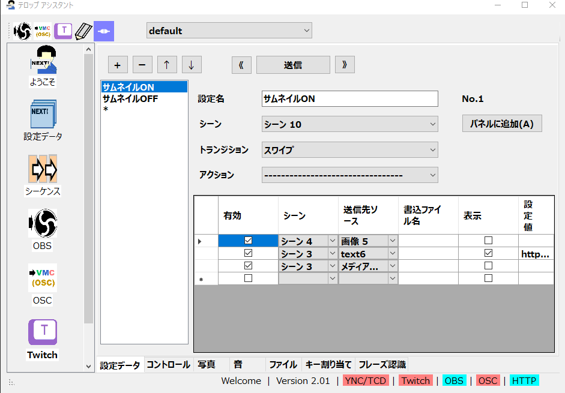
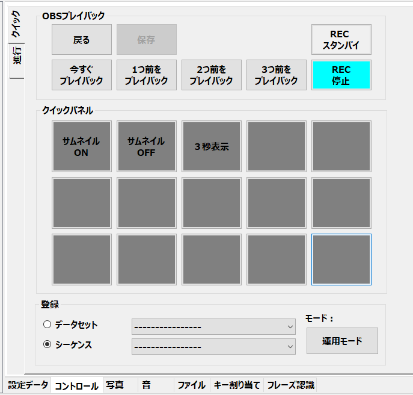
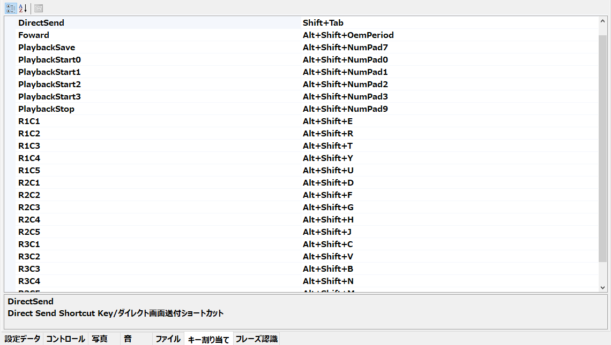

!!! Info "前提条件"
    * OBSにつないでから実施した方が圧倒的に快適です

## 設定データを作る

* その処理でどの様なデータを送るかを決めるものです。
* いわば、「画面に何を設定してほしいか」を設定するものだとおもってください

|項目|意味|
|---|------|
|設定名|見た目で分かる設定の名前を付けます|
|シーン|その設定を送るときに表示するシーンの名前を付けます|
|トランジション|切り替え時の表示効果を選びます|
|アクション|この時にOBSがおこなう動作を設定します ・レコーディングバッファON/OFF ・プレイバック（今～3回前） ・プレイバック終了 ・プレイバックセーブ ・ストリーミング開始、終了|
|有効|その設定項目を反映するかどうか|
|シーン|反映するシーン先|
|送信先ソース|対象となるソース名|
|書き込みファイル名|OBSファイル連携時に、そのファイル名にデータを書きます|
|表示|そのソースを表示するかどうか|
|設定値|表示する内容 ・テキストソース：文章 ・ブラウザ：URL ・画像、動画ソース：メディアファイル|

* 「＋」で項目を作り、設定を入れます。
* 「ー」で項目を削除できます。
* 「送信」で試し送信ができます。

## パネルに割り当てる

* 実際に運用するときに使うパネルになります

!!! Tips "編集時にはモードを切り替えます"
    * 右下のモードを切り替えることで、編集と運用を切り替えます
    * 運用モード時は、ボタンを押すと実際にOBSに設定が送信されます

* 設定をするには、下記の方法でおこないます。
    * 1) モードを登録モードにかえます
    * 2) データもしくはシーケンスを選びます。
    * 3) プルダウンの中から割り付けたい設定を選びます。
    * 4) 割り付けたいボタンを押します
    * 5) パネルを右クリックして、色を選びます
    * 6 モードを運用モードに戻します

## ショートカット登録

* このキーを押したときに、設定を有効にします。

|項目|意味|
|---|------|
|DirectSend|直接送信|
|Foward|設定データを1つ進める|
|Reverse|設定データを1つ戻す|
|PlaybackSave|プレイバックデータを保存|
|PlaybackStart0|現在のプレイバックデータを再生|
|PlaybackStart1|1つ前のプレイバックデータを再生|
|PlaybackStart2|2つ前のプレイバックデータを再生|
|PlaybackStart3|3つ前のプレイバックデータを再生|
|PlaybackStop|プレイバックの再生を終了|
|R1C1|上から１つめ、左から１つ目のパネルに割り当てられたものを起動|
|R1C5|上から１つめ、左から５つ目のパネルに割り当てられたものを起動|
|R2C1|上から２つめ、左から１つ目のパネルに割り当てられたものを起動|
|R3C5|上から３つめ、左から５つ目のパネルに割り当てられたものを起動|
