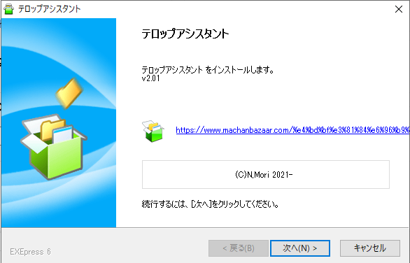
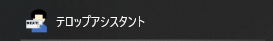

# インストール

* サイトからダウンロードしたプログラムを開きます。

* インストールがおわるとスタートメニューに項目が増えます。使う方のメニューを起動してください。

!!! Info "起動しない場合について"

    * [.Net4.8ランタイム](https://dotnet.microsoft.com/ja-jp/download/dotnet-framework/thank-you/net48-offline-installer)が必要です。[.Net4.8ランタイム](https://dotnet.microsoft.com/ja-jp/download/dotnet-framework/thank-you/net48-offline-installer)を導入してください。
