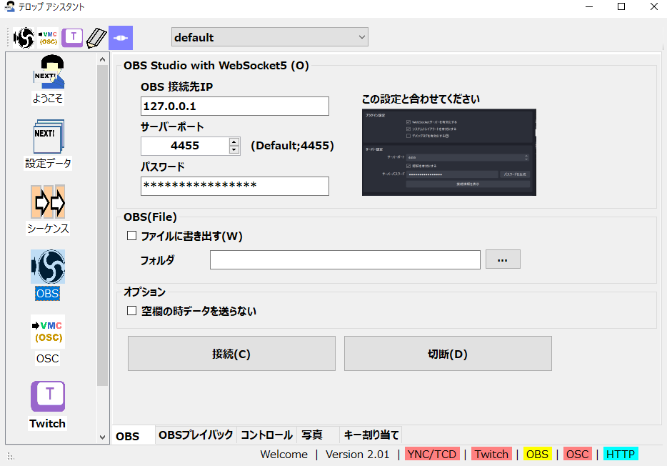

# OBSに接続する

## 共通

### OBS接続設定

* OBS StudioのWebSocket通信をつかって接続できます。
* OBS v28以降に対応しています。
* 設定したら接続をおします。うまく接続できれば、画面下「OBS」の枠が青色になります。

### OBSファイル設定

* OBS StudioのWebSocketではなく、ファイル読み込み機能をつかって字幕をだせます。
* Xsplit、N Air、StreamLabs OBSなどに対応できますが、機能としては多くが制約をうけます。

